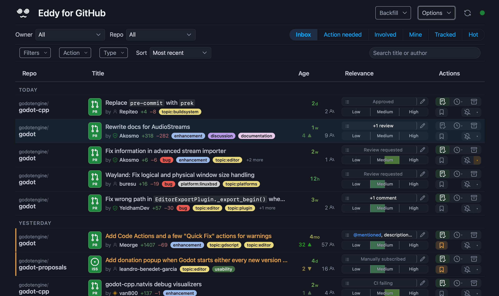

# Eddy for GitHub

A small local web app that helps you keep up with your GitHub notifications.
Eddy is designed to be lightweight and integrate into your workflow.

Eddy shows your GitHub notifications, assigned issues and PRs, and anything
else you want to add, as one ranked list. Decide what needs your attention
and take notes for later.



## Who it's for

Anyone whose GitHub feed has grown past the point where scrolling through it
is reasonable — maintainers, contributors juggling several repos, engineers
on busy teams. If you've started missing things, or you check more often than
you'd like and still feel behind, give it a try.

## Features

- **More inbox verbs** — snooze, partial unsubscribe, track; on top of GitHub's read/done/mute.
- **Priority queue** — rank rows by what matters to you, to find it again later.
- **Built for digital health** — bystander throttling and your choice of refresh cadence (Live / Hourly / Daily / Manual).
- **Condensed thread view** — comments and reviews boiled down, with room for your own notes.
- **Optional AI assistant** — opt-in, suggestion-only; never touches GitHub or your row state.

## The Eddy workflow

Eddy is designed for a two-mode loop. New items arrive via GitHub notifications. You skim them,
set a priority, and move on. When you have time to act, sort by priority and pick one.
It's lightweight by design: full triage is best done elsewhere; Eddy is just for your personal queue.

If you prefer, you can use the optional AI assistant to do the triage pass for you,
based on a `preferences.md` you write.

## Setup

Requires Python 3.11+.

```bash
python3 -m venv .venv
source .venv/bin/activate
pip install -e .
python -m app run
```

First launch opens GitHub in your browser for OAuth (scopes `notifications`,
`read:org`); the token lives in `data/auth.json`. Then open
http://127.0.0.1:5734.

Licensed under [MIT](./LICENSE.md).

## Configuration

Most options live in `config/settings.toml` and can be changed in-app.

You can also set up a `.env` file with secrets or machine-specific overrides.
This is also where you configure the AI assistant API key.

To configure the AI assistant, set up a `config/preferences.md` file with your
preferences for triage. You can also tweak the system prompts from the `app/`
folder, if you want.

## Something is not working, help!

Please [open an issue](https://github.com/Ivorforce/Eddy-for-GitHub/issues)
with what you saw and what you expected.

## Building / contributing

Python 3.11+, stdlib `venv` + `pip`, no lockfile. Schema migrates via a
hand-rolled version ladder in `app/db.py`. See [CONTRIBUTING.md](./CONTRIBUTING.md) for more info.
